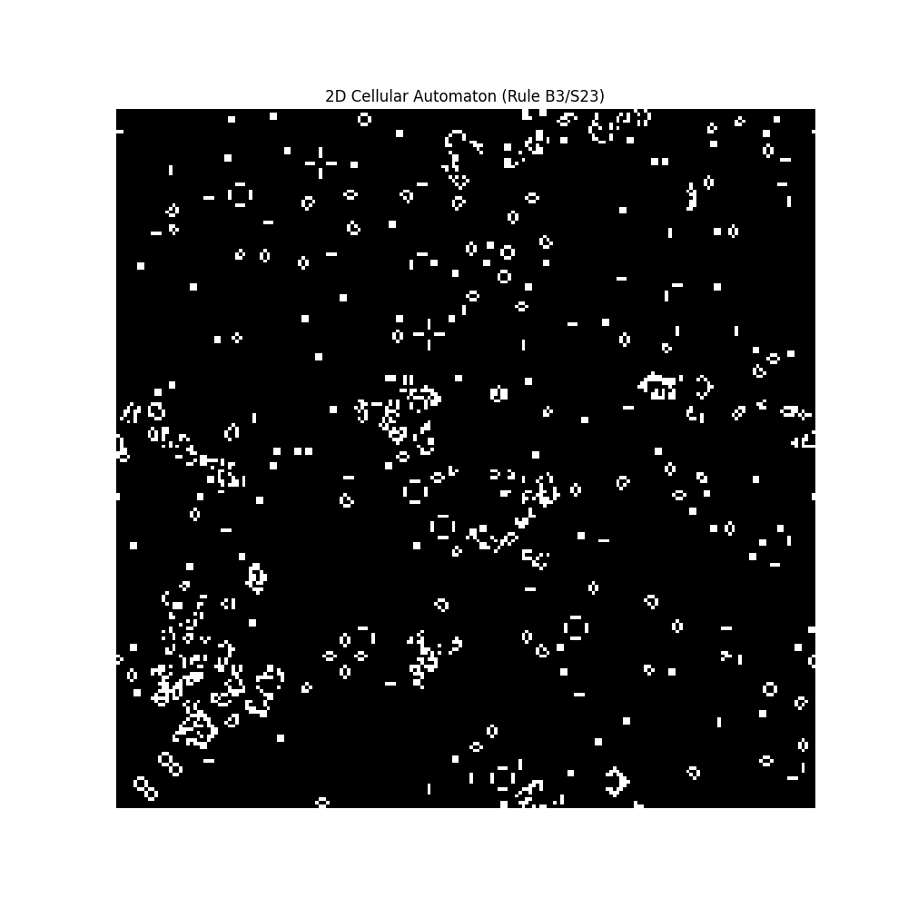

# Cellular Automata: Exploring Complexity from Simplicity

## What are Cellular Automata?

Cellular automata (CAs) are grid-based mathematical models where cells evolve according to simple, local rules. They demonstrate how complex, global behavior can emerge from these simple rules.

## Historical Context

- **Early Work:** John von Neumann and Stanisław Ulam pioneered CAs in the 1940s to explore self-replication.
- **Game of Life:** John Conway’s *Game of Life* (1970) showcased emergent behavior, where simple rules lead to complex, unpredictable patterns.
- **Formal Classification:** Stephen Wolfram’s research in the 1980s classified CAs and highlighted their computational universality.

## How This Code Works

This implementation simulates a **2D cellular automaton** on an `x × y` grid, where each cell is either alive (`1`) or dead (`0`).

### **Neighborhood and Rules**

- **Neighborhood Type:** The default is the **Moore neighborhood**, where a cell interacts with its 8 immediate neighbors.
- **B/S Notation:** Rules are defined using **B/S notation** (e.g., `B3/S23`):
  - `B3`: A dead cell becomes alive if it has **3** live neighbors (**Birth**).
  - `S23`: A live cell survives if it has **2 or 3** live neighbors (**Survival**).
- **Rule Validation:** The program ensures correct formatting and prevents invalid rules from causing crashes.

### **Kernel Scaling**

The **convolution kernel** determines how neighbors influence a cell. The default implementation uses a **Moore neighborhood** with `KERNEL_SIZE = 3`, meaning each cell interacts with **8 neighbors** (3×3 grid, excluding the center).

#### **Increasing `KERNEL_SIZE` while keeping Moore neighborhood**

- Increasing `KERNEL_SIZE` to **5** expands the neighborhood to a **5×5** grid, meaning each cell interacts with **24 neighbors** instead of 8.
- The **B/S rule must be adjusted** to reflect the larger neighborhood.
- No changes to the kernel function are needed—only updating `KERNEL_SIZE` is required.

#### **Switching to a different neighborhood type (e.g., Von Neumann)**

- The **convolution kernel must be redefined** to match the new neighborhood structure.
- For example, a **Von Neumann neighborhood (5×5)** considers a **Manhattan distance of 2**, interacting with **12 neighbors** instead of 24.
- Simply increasing `KERNEL_SIZE` does **not** change the neighborhood type automatically—you must modify the **kernel definition function**.

#### **Users should ensure that:**

✔ The `create_kernel()` function matches the intended neighborhood type.  
✔ The **B/S rules** are adjusted for the expanded neighborhood.  
✔ **Performance** is considered, as larger kernels increase computational cost.

## Optimizations: Efficient Computation

- **Convolution:** `scipy.signal.convolve2d` efficiently computes neighbor counts.
- **Vectorization:** NumPy’s `np.isin` applies rules to all cells simultaneously.
- **Efficient Animation:** `matplotlib` is used for smooth visualization.

## **Understanding the Dynamics**

### **Key Metrics**

The code (only the version with statistics `cellular_w_statistics`) tracks two key statistics to analyze the CA’s behavior:

1. **Population Decay (Live Cells):** The count of live cells (`1`s) over time.
2. **Shannon Entropy:** Measures the "disorder" in the distribution of live and dead cells.

### **Entropy Interpretation**

- **High Entropy (~1):** High randomness, often in dynamic, oscillating patterns.
- **Low Entropy (~0):** High order, typically seen in static or repetitive patterns.

### **Live, Dead, Static, and Dynamic Cells**

- **Live Cell (`1`)**: Active in the simulation.
- **Dead Cell (`0`)**: Inactive state.
- **Static Cell:** A cell that never changes state.
- **Dynamic Cell:** A cell that alternates between live and dead states.

## **Exploring Different Rule Sets**

The behavior of the automaton depends on the chosen rule set:

| Rule Name      | Rule (`B/S`)      | Description |
|---------------|------------------|-------------|
| **Game of Life** | `B3/S23`       | Classic rule set producing rich emergent structures. |
| **HighLife**   | `B36/S23`        | Similar to Game of Life but allows self-replication. |
| **Day & Night** | `B3678/S34678`  | Symmetric rule where patterns evolve similarly in positive and negative space. |
| **Seeds**      | `B2/S`           | Explosive automaton where all cells die unless new ones are born. |
| **Replicator** | `B1357/S1357`    | Produces self-replicating patterns. |
| **Diamoeba**   | `B35678/S5678`   | Expanding and contracting structures resembling amoebas. |
| **Morley**     | `B368/S245`      | Produces chaotic, glider-like movement. |
| **Long Evol**  | `B356/S23`       | Extended evolution dynamics. |

Users can **experiment** by modifying the `RULE` variable. If using a **larger kernel**, adjust the **B/S rules** to maintain meaningful behavior.

## **Applications and Significance**

Cellular automata are used in:

- **Natural Systems:** Modeling population dynamics, crystal growth, and fluid behavior.
- **Artificial Intelligence:** Studying emergent behavior and decentralized computing.
- **Computational Theory:** Demonstrating how simple rules can perform universal computation.

### **Key Concepts Illustrated**

✔ **Emergence:** Complex patterns arising from simple local interactions.  
✔ **Computation:** Cellular automata’s connection to Turing completeness.  
✔ **Chaos Theory:** The interplay of order and randomness in evolving systems.

This implementation efficiently visualizes the evolution of a CA, showcasing the fascinating relationship between **local rules and global complexity**.
